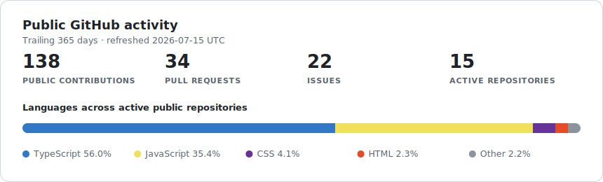
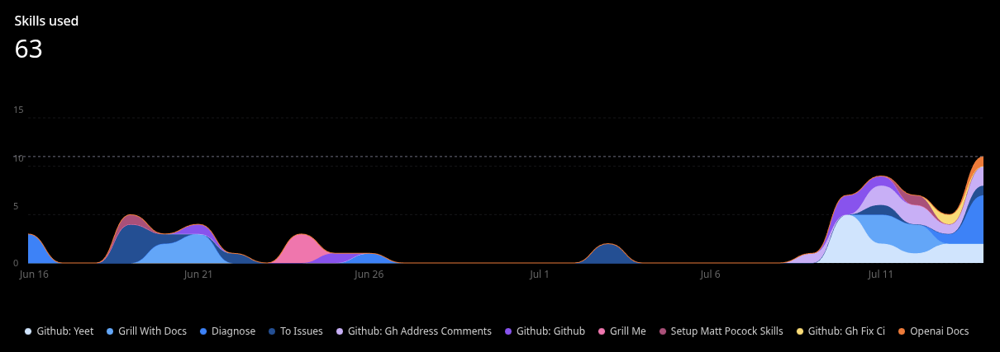

# Fellipe Corominas

> Full-stack TypeScript engineer building reliable web products from interface to infrastructure.

I build Next.js and React applications where product behavior crosses interfaces, data models, authentication, third-party services, and background automation. My recent work combines PostgreSQL, AWS integrations, scheduled jobs, and automated unit and browser testing.

## Selected work

### [Stock Alerts](https://github.com/LeFelps/stock-alerts)

An authenticated B3 market-monitoring application with watchlists, moving-average signals, scheduled market checks, and Amazon SES email digests.

`Next.js` · `TypeScript` · `PostgreSQL` · `Drizzle ORM` · `AWS SES` · `Vitest` · `Playwright`

### [Unseal](https://unseal.fellcor.com)

A browser-based digital gift experience for creating personal packages with photos, notes, and paced reveals for someone special.

`Next.js` · `TypeScript` · `PostgreSQL` · `AWS S3` · `Stripe`

## Technical focus

- **Product and web:** TypeScript, React, Next.js
- **Backend and data:** PostgreSQL, Drizzle ORM, authentication, scheduled jobs
- **Cloud and quality:** AWS, GitHub Actions, Playwright, Vitest

## Public GitHub activity

<picture>
  <source media="(prefers-color-scheme: dark)" srcset="assets/github-stats-dark.svg">
  <source media="(prefers-color-scheme: light)" srcset="assets/github-stats-light.svg">
  
</picture>

Generated from public GitHub data. Private activity is excluded.

## How I use Codex

This chart reflects the recurring AI-assisted engineering workflows I use across planning, diagnosis, implementation, review, and documentation.

